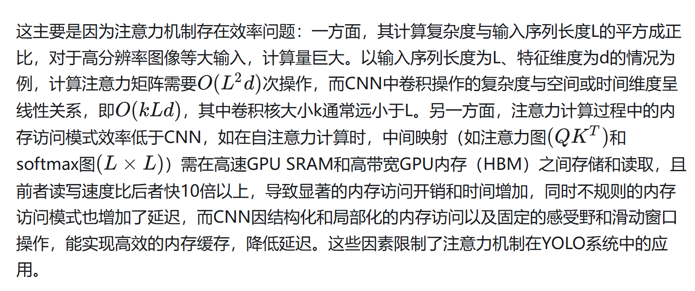
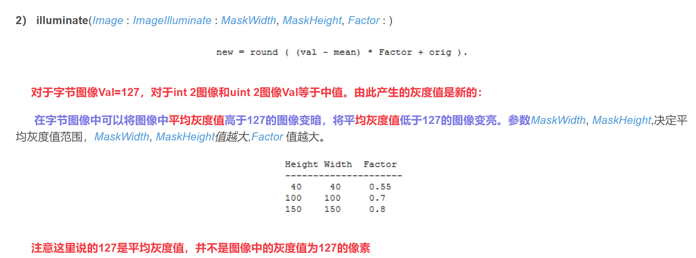
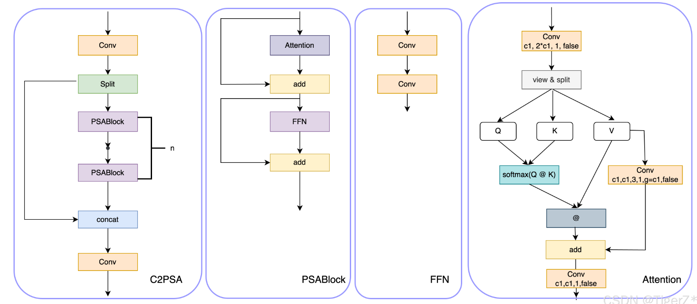

# 参考链接

- 链接: https://blog.csdn.net/Z960515/article/details/138952993

# 研究问题

- 由于GT融合数据的稀缺性，对融合模型的有效训练具有挑战性。
- 单个传感器，难以捕捉到目标的完整信息。不存在传感器能够同时捕捉到目标的所有特征
- 基于生成式的方法，认为融合图像属于相同分布，具有解释性差，难以训练等问题
- 常规的优化方法，求解的是原图像图像特征直接与融合图像特征的映射，忽略了源图像之间的相关性


# 解决方法

- 基于自监督学习的方法，提出了一种名为EMMA的新型自监督学习范式，旨在解决图像融合中真值缺失的问题
- 通过伪感知模块和感知损失分量有效地模拟感知成像过程，改进了传统融合损失中对融合图像和源输入之间域差异的不恰当处理。
- 提出的U - Fuser融合模块熟练地建模跨多个尺度的长、短程依赖关系来整合源信息。
- 方法在红外-可见光图像融合和医学图像融合中表现出优异的性能，这也被证明有利于下游的多模态目标检测和语义分割任务。
- 作者用15个顶会融合后的数据作为GT，训练Ai，Av；因为图像输入输出有相同的size，所有选用unet；<font color="red">如果有不同的size呢？</font>
# 个人想法

- 先用一个预训练的模型来求解特征，预训练模型用的unet，该模型提取特征效果不是最佳，并且推理速度慢；
- unet需要图像输入输出有相同的size，训练出来的特征，并不能完美的模拟出真实传感器分布。替换成最新的backbone效果更好；<font color="red">打印出改进前和改进后的特征图</font>

- UNet进行图像融合，可替换Unet的模块，参考mmsegementation中的模型；替换理由为替换模型设计的优势以及为什么设计。https://github.com/open-mmlab/mmsegmentation

- 图像变换，常用的图像变换粗暴的添加进去，做消融实验验证加了比不加好
- 参考作者逻辑加一个图像增强模块，先训练好，再freeze。替换它的Ai,Av;选顶会的模型，不用训练直接用；省去训练Ai,Av；
- Ai,Vi本质是图像增强，目前top的图像增强网络是HVI。先训练后增强；训练得到传感器特性
- 原始模型，不是端到端的训练。

- 链接： https://docs.ultralytics.com/zh/models/yolo12/#overview
- YOLOV12 使用Area attention；更大感受野，更小计算量
- 常规的融合算法，都只强调算法效果，未强调性能。目前Unet和Ufuser结构，效率上差。https://zhuanlan.zhihu.com/p/24876772668


- 论文使用多头注意力机制提取全局特征 https://zhuanlan.zhihu.com/p/647747759、https://zhuanlan.zhihu.com/p/509582087

**HVI: A New color space for Low-light Image Enhancement**

- Paper: https://arxiv.org/abs/2502.20272
- Code: https://github.com/Fediory/HVI-CIDNet
- Demo: https://huggingface.co/spaces/Fediory/HVI-CIDNet_Low-light-Image-Enhancement_

- <font color="green">借鉴论文，应用到红外-可见光图像融合</font>

**YOLOv12: Attention-Centric Real-Time Object Detectors**

- 参考： https://zhuanlan.zhihu.com/p/24876772668
- paper：https://arxiv.org/pdf/2502.12524

# 创新
- propose a simple yet efficient area attention module(A2), which maintains a large receptive field while reducing the computational complexity of attention in a very simple way, thus enhancing speed.


# 摘要

红外与可见光图像融合结合了红外图像的热目标信息和可见光图像的纹理细节，显著提升了场景感知能力。然而，现有方法往往仅考虑单一传感器，或简单叠加多传感器信息，忽略了不同模态在不同环境下的重要性变化，导致关键信息丢失或冗余。针对上述问题，本文提出了一种基于EMMA框架的改进方法：通过注意力分支分别学习红外与可见光图像的动态权重，实现两种模态特征的差异化贡献；设计融合注意力的双分支特征解耦模块，深度融合权重学习与多模态特征提取；引入轻量级高效主干网络替换传统Unet，解决输入尺度不一致问题并强化特征提取能力。实验结果表明，该方法在红外-可见光图像融合任务中取得了优异的主观视觉质量和客观评价指标，有效提升了复杂场景下的融合性能。

# Introduction


## 研究背景与意义
红外图像的优势：热辐射感知、穿透能力
可见光图像的优势：高分辨率、纹理细节
互补性需求：单一传感器存在信息缺失

红外与可见光图像融合技术通过整合两种模态的互补信息来提升场景感知能力，在安防监控、自动驾驶和夜视等领域具有重要应用价值。然而，现有方法仍面临若干关键挑战：

## 1.1 现存问题


总述：当前技术存在三大瓶颈
分述：
1. 光照敏感性问题 → 可见光图像质量退化
2. 架构局限性 → U-Net处理多尺度效率低
3. 特征融合粗放 → 忽略模态特性差异
### (1) 可见光图像光照不均问题
可见光图像常因光照条件变化导致欠曝光或过曝光区域的细节丢失。虽然现有融合算法能改善整体对比度，但在极端光照条件下仍难以保持精细纹理特征，具有进一步提升空间。

### (2) 传统融合框架的局限性
现有深度学习方法多基于U-Net或CNN主干网络，这类结构在处理多尺度输入时效率不足且缺乏轻量化特性。

### (3) 特征表达不均衡问题
现有融合方法通常对红外（I）与可见光（V）图像采用统一处理，忽略了二者的特性差异。

## 1.2 解决方案

| 问题                | 解决方案                     |
|---------------------|----------------------------|
| 光照不均匀          | 增强特征提取分支            |
| 架构效率低          | EMMA轻量主干               |
| 特征融合不均衡      | 混合注意力机制             |

### 改进架构
在**EMMA框架下引入轻量级高效主干网络**取代传统U-Net结构。这一改进：
- 解决了输入尺度不一致问题
- 显著增强了判别性特征提取能力

### 非对称伪感知模块

双分支特征解耦
- 模态特异性编码器

  - 红外分支：聚焦于热辐射特征（如高温目标、热轮廓）

    - 使用浅层网络（3层CNN）提取全局热分布

  - 可见光分支：专注纹理细节（如边缘、色彩）

    - 采用深度残差网络（ResNet-18变体）强化局部特征

- 共享特征空间投影

  - 通过对抗训练约束，使两类特征映射到统一潜在空间

  - 损失函数：
  $$ \mathcal{L}_{adv} = \mathbb{E}[\log D(F_{IR})] + \mathbb{E}[\log(1-D(F_{RGB}))] $$
  


$$ \mathcal{L}(A_{v}(\mathcal{f}),v) = \mathbb{E}[\log D(F_{IR})] + \mathbb{E}[\log(1-D(F_{RGB}))] $$


提出**双分支处理策略two-stage fusion approach**：

- **可见光图像**分支：采用**增强特征提取**以恢复光照抑制的细节
- **红外图像**分支：采用**简化特征提取**，在保留热目标的同时减少冗余

### 混合注意力融合
- 跨模态门控注意力（Cross-modal Gated Attention
   - 动态特征加权
     - 通过通道注意力（SE模块）计算模态间权重：
    $$ \alpha_c = \sigma(W_2 ReLU(W_1[F_{IR}||F_{RGB}])) $$
     - 空间注意力补充：
   ```python
        spatial_attn = Conv2d(concat(IR_feat, RGB_feat), kernel=7x7)
        output = spatial_attn * IR_feat + (1-spatial_attn) * RGB_feat 
   ```


设计**混合注意力机制**：
- 结合通道注意力与空间注意力
- 动态强化关键特征（如红外热目标与可见光边缘）
- 显著提升融合鲁棒性

## 1.3 主要贡献
1. 基于EMMA框架的轻量级主干网络，实现高效多尺度特征提取
2. 面向I/V图像差异化处理的双分支伪感知模块
3. 增强关键特征表达的混合注意力融合模块

## 1.4 实验结果
实验结果表明，该方法在：
- 主观视觉质量
- 客观评价指标（如EN、SSIM）

均优于现有算法，有效提升了复杂场景下的融合性能。

# METHODOLOGY
- 介绍红外可见光图像融合的重要性，以及目前存在的问题
- 介绍EMMA框架，以及其存在的问题
  - V图像是RGB图像，存在光照问题，需要增强

## 引入模型整体介绍


## 动态非线性亮度映射（Dynamic Non-linear Lightness Mapping, DNLM）




- 1.1 动态参数化S形曲线
亮度变换公式：
$$ I_{out}(x,y) = \frac{1}{1 + e^{-k(x,y) \cdot (I_{in}(x,y) - \tau(x,y))}} $$

参数定义：
- $k(x,y)$：曲线陡峭度
  $$ k(x,y) = \alpha \cdot \frac{\sigma(x,y)}{\mu(x,y) + \epsilon} + \beta $$
- $\tau(x,y)$：动态阈值
  $$ \tau(x,y) = \gamma \cdot \mu(x,y) + \delta $$

- 1.2 语义引导约束
语义掩膜修正：
$$ k'(x,y) = k(x,y) \cdot (1 - \lambda \cdot S(x,y)) $$


- 2. 实现步骤

1. **局部统计计算**
   - 使用$15\times15$邻窗
   - 积分图加速

2. **曲线参数预测**
   - 轻量级CNN/LUT
   - 超网络动态生成

3. **像素级映射**
   - 逐像素S形变换
   - 导向滤波后处理

- 3. 优势对比

| 特性               | DNLM                          | 传统方法          |
|--------------------|-------------------------------|------------------|
| 自适应能力         | 像素级动态调整               | 全局固定参数      |
| 语义感知           | 支持区域抑制                | 无区分           |
| 计算效率           | 实时处理4K                  | 通常更快         |


- EMMA中，存在伪感知模块backbone,Unet通过特征图可视化可知，细节特征提取的不佳；选用优化后的backbone，效果更好

# UNet作为Backbone的局限性及新型Backbone设计思路

## UNet的核心缺陷

### 1. 计算效率问题
- 对称编解码结构带来大量冗余计算
- 跳跃连接导致特征图尺寸频繁变化，内存访问效率低
- 浅层特征重复传递增加显存消耗

### 2. 特征融合瓶颈
- 简单的通道拼接(concat)操作限制多尺度特征交互
- 缺乏跨尺度注意力机制
- 深层语义信息与浅层细节融合不充分

### 3. 感受野局限
- 标准卷积核难以捕获长程依赖
- 下采样策略导致空间信息不可逆损失
- 对超大尺寸对象分割效果下降

### 4. 动态适应性不足
- 固定网络结构难以适应不同模态数据
- 缺乏对病灶形状变化的鲁棒性处理

## 创新Backbone设计原则

### 1. 异构图灵架构
```python
class HeteroBlock(nn.Module):
    def __init__(self, in_c, out_c):
        super().__init__()
        self.branch1 = nn.Sequential(
            DepthwiseSepConv(in_c, out_c//2),
            ChannelAttention(out_c//2))
        self.branch2 = nn.Sequential(
            DilatedConv(in_c, out_c//4, dilation=3),
            SpatialAttention())
        self.branch3 = nn.Identity() if in_c==out_c else Conv1x1(in_c, out_c-out_c//2-out_c//4)
        
    def forward(self, x):
        return torch.cat([self.branch1(x), 
                        self.branch2(x),
                        self.branch3(x)], dim=1)
```
### 2. 多尺度感知模块
```python
class MSAP(nn.Module):
    def __init__(self, channels):
        super().__init__()
        self.scales = nn.ModuleList([
            nn.AvgPool2d(2**i, 2**i) for i in range(4)])
        self.fuse = nn.Conv2d(channels*4, channels, 1)
        
    def forward(self, x):
        feats = [F.interpolate(s(x), x.shape[2:]) for s in self.scales]
        return self.fuse(torch.cat(feats, dim=1))
```

- EMMA中Uf模块以Unet为结构，将Restormer做为基础模块；参考上述unet替换的改进结构；
https://blog.csdn.net/u012863603/article/details/142977809
改进选用C2PSA它结合了PSA(Pointwise Spatial Attention)块，用于增强特征提取和注意力机制<font color="green">yoloV11</font>



# 相关工作

- 介绍EMMA框架，以及其存在的问题
- 介绍其他红外可见光图像融合方法，以及存在的问

# 实验
  介绍实验结果，以及与其他方法的对比
- 数据集选择：DroneVehical（https://github.com/VisDrone/DroneVehicle
  MSRS IVF dataset https://blog.csdn.net/jiexiang5396/article/details/134851286
- 对比模型选择
- 对比模型特征图可视化
- 对比模型效果表以及曲线


