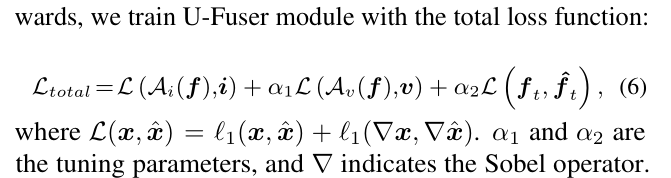
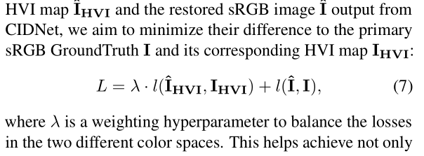

颜色空间增强下的红外可见光多模态图像融合

# 摘要

　　红外与可见光图像融合结合了红外图像的热目标信息和可见光图像的纹理细节，显著提升了场景感知能力。然而，红外和RGB传感器优缺点各异。现有方法往往仅考虑单一传感器，或简单叠加多传感器信息，忽略了不同模态在不同环境下的重要性变化，导致关键信息丢失或冗余。针对上述问题，本文提出了一种基于EMMA框架的改进方法：通过注意力分支分别学习红外与可见光图像的动态权重，实现两种模态特征的差异化贡献；设计融合注意力的双分支特征解耦模块，深度融合权重学习与多模态特征提取；引入轻量级高效主干网络替换传统Unet，解决输入尺度不一致问题并强化特征提取能力。实验结果表明，该方法在红外-可见光图像融合任务中取得了优异的主观视觉质量和客观评价指标，有效提升了复杂场景下的融合性能。

# Introduction
　　图像融合是将同一场景下不同传感器或同一传感器在不同条件下获得的多幅图像合成一幅复合图像的技术。其意义在于将输入图像的冗余信息和互补信息整合到最终的融合图像中去，使得融合图像单张输入图像具有更丰富的信息便于后续的图像处理任务，例如数字摄影、遥感、农业、医学和生物识别等领域。
　　可见光波段具有高分辨率和极其细腻的纹理特征，最符合人眼视觉范围，生成的图像与人类日常生活中观察到的景象高度相似。然而，极易受到遮蔽物、天气条件等因素的显著干扰。
　　红外图像具有热辐射感知、穿透能力强可透过烟雾、薄雾等介质，材料识别：不同材料发射率差异显著。但是空间分辨率较低，热扩散效应导致边缘模糊，高噪声：非均匀性噪声（NU）、时序噪声明显。

因此红外和可见光融合问题回归到以下几个点。不同成像模态（如红外/可见光）反映的物理特性不同（热辐射 vs 光反射），导致特征分布存在本质差异。各模态图像处于不同的特征流形（feature manifold），直接线性融合（如加权平均）会导致特征冲突。红外图像中高温区域（亮）与可见光对应区域（可能暗）的像素级矛盾。

早期图像融合方法大致可分为以下两类：空间域融合方法与变换域融合方法。随着近年来图像融合技术的发展，传统分类方法已无法满足需求。基于现有理论技术，图像融合技术可细分为多尺度分解、稀疏表示、神经网络、子空间、显著性分析、混合方法、压缩感知以及深度学习等多种类型。深度学习初期，具有自动编码器（AE），通过编码-解码结构提取特征，但融合策略仍需人工设计和卷积神经网络（CNN）：如DenseFuse，利用CNN提取局部特征，但忽略全局依赖。深度学习成熟期生成对抗网络（GAN）和Transformer逐渐应用于图像融合任务，GAN通过使源图像与融合图像服从相似分布来实现融合，但其存在可解释性不足、可控性差以及训练难度大等缺陷，易出现纹理失真。而Transformer则通过自注意力机制捕捉长距离依赖关系，提升融合效果，但计算复杂度高。最新主流融合算法采用多模态混合架构如CMFuse结合优化跨模态交互，EMMA通过已有算法融合结果来学习传感器分布，进而用于指导自己模型获取更佳训练效果，但在光照不均匀、噪声干扰等复杂场景下仍存在不足。针对上述研究进程，我们总结目前有以下几点问题待解决：
### (1) 可见光图像问题
可见光图像常因光照条件变化导致欠曝光或过曝光区域的细节丢失。虽然现有融合算法能改善整体对比度，但在极端光照条件下仍难以获取有效效果。
### (2) 常规融合框架的局限性
现有融合模型框架，通常对红外（I）与可见光（V）图像采用统一特征提取模型。不适用于HVI增强策略。
### (3) 特征提取的不充分性
主流特征提取网络已经迭代，更换更强网络。效果显著提升，效率显著提高

针对以上问题，我们提出以下解决方案：
### (1) HVI自适应亮度增强策略
1、RGB图像的低光区域去噪与亮度增强特征提取模块。该模块通过将图像转换至HVI色彩空间，增强低光照区域细节，并保留高光区域细节，从而提升融合图像质量。
2、红外图像的热目标特征提取模块。该模块通过简化特征提取，专注于热目标的辐射特征，减少冗余信息。
### (2) 非对称融合模块 双分支处理策略two-stage fusion approach**
。
- **可见光图像**分支：采用**HVI亮度增强策略**以恢复光照抑制的细节
  - 可见光分支：专注纹理细节（如边缘、色彩）HVI
  - 选用HVI颜色空间增强、提升RGB图像低光照下的色彩和细节表现
- **红外图像**分支：采用**简化特征提取**，在保留热目标的同时减少冗余

-  **改进架构，混合注意力融合**
- 
### (3) PanNet策略
我们的贡献有：
1. 提出了HVI自适应亮度增强策略。提升了弱光条件下，融合的稳定性与鲁棒性
2. HVI模块与主流融合模块相结合，构造非对称融合模块 双分支处理策略two-stage fusion approach**
3. 引入最新特征提取网络，增强关键特征表达的混合注意力融合模块，效果显著提高

# METHODOLOGY
- hvi自适应亮度增强策略

- UHVI-Fusion模块
Unet为结构，将Restormer做为基础模块；参考上述unet替换的改进结构；
https://blog.csdn.net/u012863603/article/details/142977809
改进选用C2PSA它结合了PSA(Pointwise Spatial Attention)块，用于增强特征提取和注意力机制yoloV11

- 整体框架流程介绍
- 损失函数介绍Loss function and training detail
损失函数两部分组成：EMMA框架损失函数、HSI；暂时杂糅一下

\[
L = \lambda \cdot \ell(\hat{I}_{\mathrm{HVI}}, I_{\mathrm{HVI}}) + \ell(\hat{I}, I)
\]
# 实验
  介绍实验结果，以及与其他方法的对比
- 数据集选择：DroneVehical（https://github.com/VisDrone/DroneVehicle）
该数据集是通过搭载双摄像头（可见光摄像头和热红外摄像头）的无人机，在不同场景、多种天气和光照条件下采集的。热红外摄像头（Thermal Infrared Camera）的工作波段通常属于 长波红外（LWIR，8~14 μm），这是由 常温物体的热辐射特性 和 大气透射窗口 共同决定的

- LLVIP Dataset，low-light vision-infrared pairing dataset；不同尺度的图像融合，以及不同场景的图像融合

  MSRS IVF dataset https://blog.csdn.net/jiexiang5396/article/details/134851286
- 对比模型选择
- 对比模型特征图可视化
- 对比模型效果表以及曲线